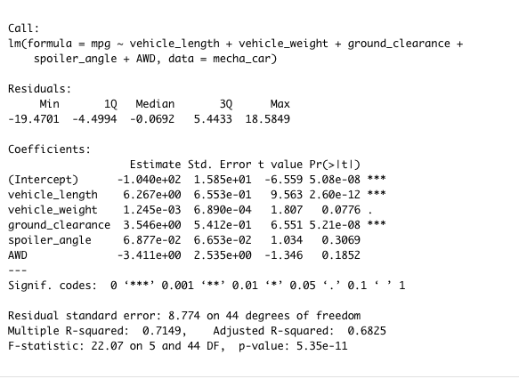
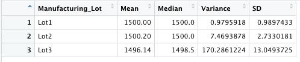
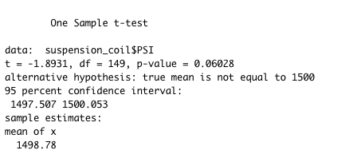
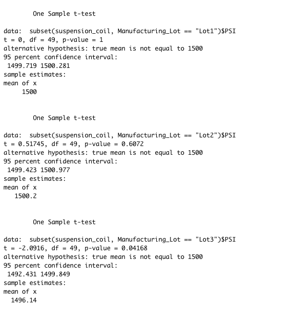

# MechaCar_Statistical_Analysis
using R to perform multiple linear regression analysis, collect summary statistics, and run t-tests

## 1 Linear Regression to Predict MPG

- Which variables/coefficients provided a non-random amount of variance to the mpg values in the dataset?
 The vehicle length, ground clearance, and intercept coefficents are all statistically significant. They have p-values of 2.60e-12, 5.21e-08, and 5.08e-08, meaning they are all less than 0.05. Therefore, there is a 5% chance that the null hypotheses (that these independent variables have no effect on mpg) is true. 
 
- Is the slope of the linear model considered to be zero? Why or why not?
The slope of this model cannot be considered zero because the p-value of the model is (), which is extremely low. If the p-value were higher, then we would failt to reject the null hypthoses that these variables have no effect on MPG. However because the p-value is so low, there is some relationship and we cannot conclude that the true slope is zero. 

- Does this linear model predict mpg of MechaCar prototypes effectively? Why or why not?
With an R-squared of 0.7149, 71.49% of variability in MPG can be explained by the independent variables. The adjusted R-squared is 0.6825, which is a better guage of model fit because it decreases when a predictor improves the model by less than expected by random chance. 

## 2 Summary Statistics on Suspension Coils

- The design specifications for the MechaCar suspension coils dictate that the variance of the suspension coils must not exceed 100 pounds per square inch. Does the current manufacturing data meet this design specification for all manufacturing lots in total and each lot individually? Why or why not?
The design specifications are met when looking at all manufacturing lots together, as the variance is 62.29. However, looking at each lot individually, Lot 3's variance is 170.29, exceeding 100. For Lot 3, the design specifications are not met.

## 3 T-Tests on Suspension Coils

- H0: True Mean = 1500
- H1: True Mean != 1500

The p-value is 0.06, so greater than alpha 0.05. Therefore, we fail to reject the null hypothesis and the true mean could be 1500.

For Lots 1 and 2, the p-value is higher than 0.05, so we fail to reject the null hupothesis. 

Lot 3, however, has a p-value of 0.04, so we fail to reject the null hypothesis. There is a 5% chance that we would have the results from Lot 3 if the true mean PSI was 1500.

## 4 Study Design: MechaCar vs Competition
Write a short description of a statistical study that can quantify how the MechaCar performs against the competition. In your study design, think critically about what metrics would be of interest to a consumer: for a few examples, cost, city or highway fuel efficiency, horse power, maintenance cost, or safety rating

- What metric or metrics are you going to test?
I would test safety rating, as I think that is generally an important thing consumers think about when purchasing cars. 
- What is the null hypothesis or alternative hypothesis?
H0: MechaCar's cars average safety rating is the same as the average competitor's vehicles H1: MechaCar's cars average safety rating is the not the same as the average competitor's vehicles 
- What statistical test would you use to test the hypothesis? And why?
I would perform a two sample t-test.
- What data is needed to run the statistical test?
I would need continuous saftey rating data to perform this test.
